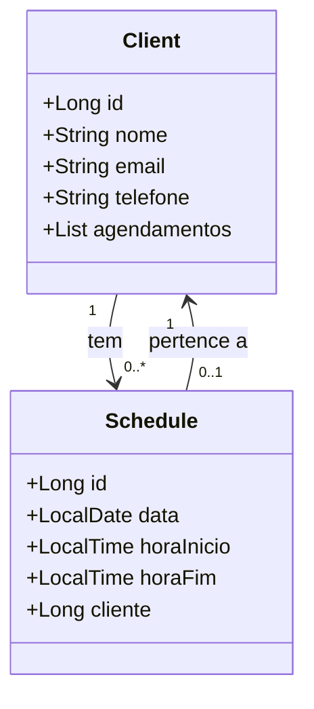

# Barber-Shop-Agenda

Este projeto é um **CRUD de agendamento para uma barbearia**, onde os clientes podem agendar horários para os serviços da barbearia. O sistema permite o gerenciamento dos agendamentos e o cadastro dos clientes utilizando **Spring Boot**.

## Funcionalidades

- Cadastro de clientes.
- Agendamento de horários para clientes.
- Visualização e controle dos agendamentos.
- Relacionamento entre clientes e seus agendamentos.

## Tecnologias Utilizadas

- **Backend**: Spring Boot
- **Banco de Dados**: PostgreSQL
- **Autenticação**: JWT (JSON Web Token)
- **Frontend**: Angular 18 (https://github.com/ricardosantanadev4/barber-shop-angular.git)
- **Hospedagem**: Render

## Estrutura do Banco de Dados

O sistema tem duas entidades principais: **Client** (Cliente) e **Schedule** (Agendamento), com os seguintes atributos:

### Relacionamento entre as Entidades

- Um **cliente** pode ter **um ou vários agendamentos**.
- Cada **agendamento** pertence a **um único cliente**.

## Diagrama de Classes

A seguir, o diagrama de classes representando as entidades **Client** e **Schedule**:



## Como Executar o Projeto


### Pré-requisitos

- Java 21 ou superior
- PostgreSQL
- Maven (para backend)

### Backend (Spring Boot)

1. Clone o repositório:
   ```bash
   git clone <url-do-repositorio>
   ```

2. Acesse a pasta do backend:
   ```bash
   cd backend
   ```

3. Configure as credenciais do banco de dados no arquivo `application.properties`.

4. Compile e execute o backend:
   ```bash
   mvn spring-boot:run
   ```

Sinta-se à vontade para fazer fork deste repositório, abrir pull requests e contribuir com melhorias no projeto.

## Licença

Este projeto está licenciado sob a [MIT License](LICENSE).

